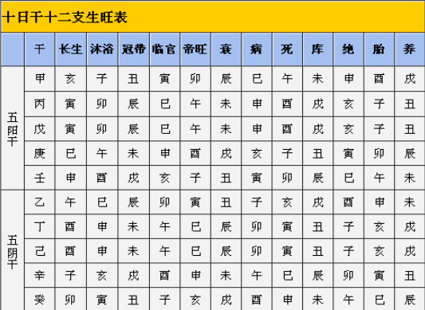

:PROPERTIES:
:ID:       796ec560-d83b-4428-9947-f3effbd6b192
:END:
#+title: 时干入墓
#+HUGO_BASE_DIR: D:/org_blog
#+DATE: 2024-01-19
#+HUGO_AUTO_SET_LASTMOD: t
#+HUGO_TAGS: 
#+HUGO_CATEGORIES: 
#+HUGO_DRAFT: false
# #+HUGO_MENU: :menu "main" :parent "docs" :weight 3
#+options: author:nil
#+HUGO_CUSTOM_FRONT_MATTER: :katex true
* 时干入墓
** 概览
该点主要是需要掌握十二长生的使用，需要掌握十天干中分别对应的入墓位置。也就是说：用事的时辰需要避开其墓所在之宫，

主要参照上面这个表，所求事的时辰要尽量的避开墓的方位，即需要避开

